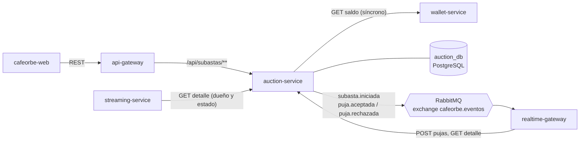
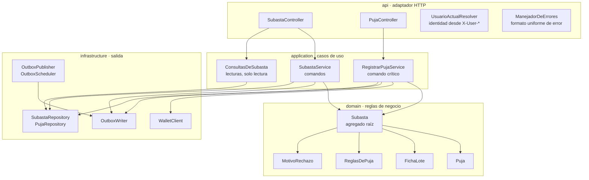
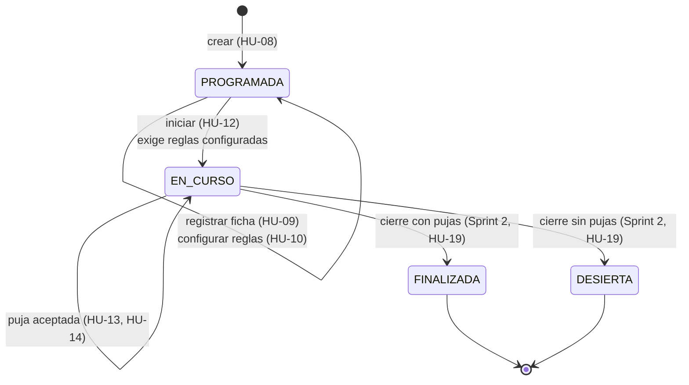
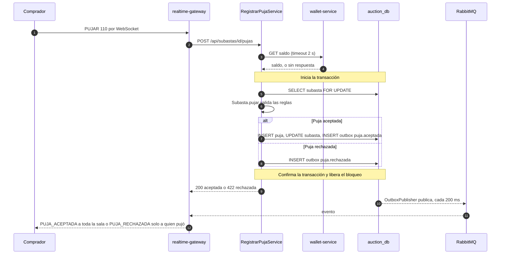
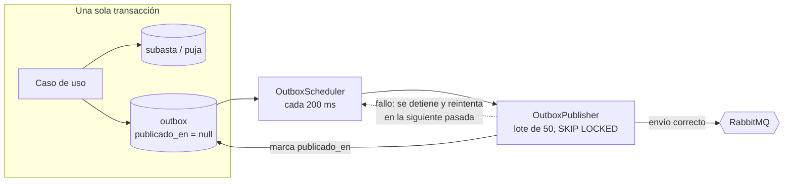
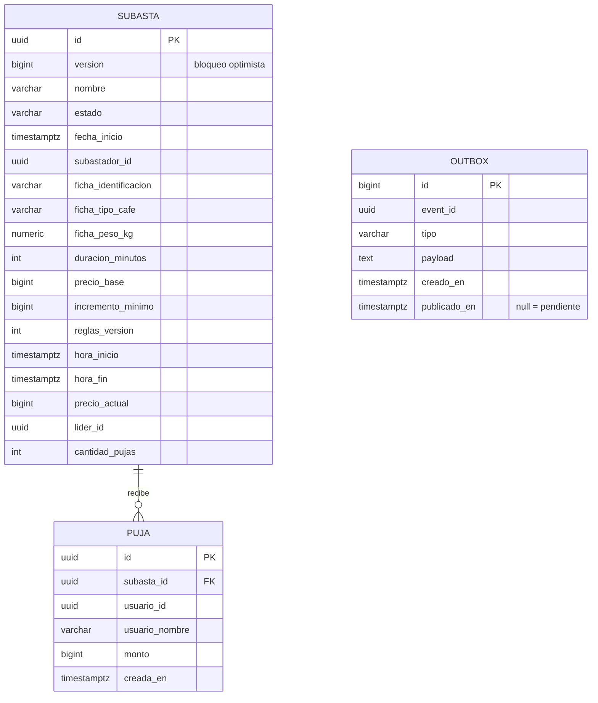
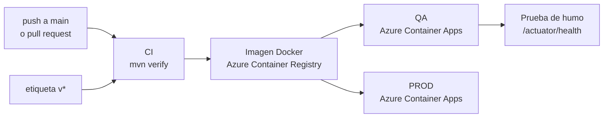

# cafeorbe-auction-service

> Núcleo de negocio de CaféOrbe: es dueño de la subasta de principio a fin (creación, ficha del lote, reglas de puja, inicio y pujas) y la única fuente de verdad sobre su estado.

| | |
|---|---|
| **Responsabilidad** | Ciclo de vida de la subasta y validación de pujas |
| **Estilo interno** | Capas con dominio rico (DDD táctico) + CQRS ligero |
| **Stack** | Java 21 · Spring Boot 3.5 · Spring Data JPA · Flyway · RabbitMQ |
| **Persistencia** | PostgreSQL, base propia `auction_db` |
| **Puerto** | `8082` |
| **Historias** | HU-03, HU-04, HU-05, HU-08, HU-09, HU-10, HU-12, HU-13, HU-14 |
| **Publica** | `subasta.iniciada`, `puja.aceptada`, `puja.rechazada` |
| **Depende de** | wallet-service (consulta síncrona de saldo) |

## Contenido

1. [Contexto](#1-contexto)
2. [Arquitectura interna](#2-arquitectura-interna)
3. [Modelo de dominio](#3-modelo-de-dominio)
4. [Contrato de la API](#4-contrato-de-la-api)
5. [Flujo crítico: registrar una puja](#5-flujo-crítico-registrar-una-puja)
6. [Eventos y outbox transaccional](#6-eventos-y-outbox-transaccional)
7. [Modelo de datos](#7-modelo-de-datos)
8. [Decisiones de arquitectura](#8-decisiones-de-arquitectura)
9. [Atributos de calidad](#9-atributos-de-calidad)
10. [Configuración](#10-configuración)
11. [Ejecución y pruebas](#11-ejecución-y-pruebas)
12. [Despliegue](#12-despliegue)
13. [Riesgos conocidos y evolución](#13-riesgos-conocidos-y-evolución)

---

## 1. Contexto

El servicio recibe comandos y consultas por REST (siempre detrás del api-gateway o desde otro servicio interno) y comunica los hechos del negocio como eventos.



Tres consumidores llaman a este servicio: el **api-gateway** (peticiones del navegador), el **realtime-gateway** (reenvía las pujas que llegan por WebSocket y valida que la sala exista) y el **streaming-service** (verifica dueño y estado antes de transmitir). En todos los casos la identidad llega en las cabeceras `X-User-Id`, `X-User-Name` y `X-User-Role`.

## 2. Arquitectura interna

Es el único servicio del sistema con reglas de negocio reales (incremento mínimo, líder, máquina de estados), por eso es el único con un modelo de dominio rico. Las reglas viven en el agregado `Subasta`; los controladores y los casos de uso no las duplican.



| Capa | Paquete | Qué contiene | Regla |
|---|---|---|---|
| API | `api` | Controladores REST, cuerpos de petición, resolución de identidad, traducción de errores a HTTP | No contiene reglas de negocio |
| Aplicación | `application` | Casos de uso que cambian la subasta (`SubastaService`, `RegistrarPujaService`) y consultas (`ConsultasDeSubasta`, `Vistas`) | Orquesta: transacción, repositorio, outbox |
| Dominio | `domain` | `Subasta` (agregado y máquina de estados), `Puja`, `FichaLote`, `ReglasDePuja`, `MotivoRechazo`, `ResultadoPuja` | No hace entrada/salida |
| Infraestructura | `infrastructure` | Repositorios JPA, `WalletClient`, outbox | Detalles técnicos reemplazables |

**CQRS ligero:** comandos y consultas comparten base de datos, pero están separados en el código. Los comandos pasan por el agregado; las consultas (`ConsultasDeSubasta`) son transacciones de solo lectura que devuelven modelos de lectura (`Resumen`, `Detalle`, `PujaVista`) pensados para el lobby y la sala.

## 3. Modelo de dominio

### Máquina de estados de la subasta



La ficha y las reglas solo se pueden editar en `PROGRAMADA`; después el servicio responde `409`. Las transiciones a `FINALIZADA` y `DESIERTA` están modeladas en `EstadoSubasta`, pero el cierre automático es alcance del Sprint 2.

### Reglas de validación de una puja

El agregado evalúa las reglas en este orden y se detiene en la primera que falla. Cada rechazo lleva un motivo tipificado y el mensaje que ve el usuario.

| Orden | Condición | Motivo | Mensaje |
|:-:|---|---|---|
| 1 | La subasta ya terminó, o ya pasó la hora de fin | `SUBASTA_FINALIZADA` | La subasta ya finalizó |
| 2 | La subasta no está en curso | `SUBASTA_NO_EN_CURSO` | La subasta no está en curso |
| 3 | Quien puja ya es el líder | `YA_ERES_LIDER` | Vas ganando |
| 4 | Monto menor que precio actual + incremento mínimo | `INCREMENTO_MINIMO` | No cumple el incremento mínimo |
| 5 | wallet no respondió | `SALDO_NO_DISPONIBLE` | No se pudo verificar tu saldo de Orbes, intenta de nuevo |
| 6 | Saldo menor que el monto | `SALDO_INSUFICIENTE` | Orbes insuficientes |

El precio actual arranca en el precio base. Los Orbes **no se reservan** al pujar: solo se comprueba que alcancen; el cobro ocurre al cierre (Sprint 2).

## 4. Contrato de la API

Todas las rutas van bajo `/api/subastas` y exigen identidad.

| Método y ruta | Rol | Historia | Respuesta |
|---|---|---|---|
| `POST /` | Subastador | HU-08 | `201` con el detalle; la subasta queda `PROGRAMADA` |
| `GET /?estado=programada,en_curso` | Cualquiera | HU-04 | Resúmenes ordenados por fecha de inicio. Sin filtro devuelve todas |
| `GET /mias` | Subastador | HU-03 | Subastas propias. `403` a un Comprador |
| `GET /{id}` | Cualquiera | HU-05 | Detalle: ficha, reglas, precio actual, próximo mínimo, líder y últimas 10 pujas |
| `PUT /{id}/ficha` | Dueño | HU-09 | `409` si la subasta ya no está `PROGRAMADA` |
| `PUT /{id}/reglas` | Dueño | HU-10 | Cada cambio sube `reglas.version`. `409` si ya inició |
| `POST /{id}/iniciar` | Dueño | HU-12 | Pasa a `EN_CURSO` y fija la hora de fin. `409` sin reglas |
| `POST /{id}/pujas` | Comprador | HU-13, HU-14 | `200` aceptada · `422` rechazada con `motivo` y `mensaje` |
| `GET /{id}/pujas` | Cualquiera | HU-14 | Historial de pujas aceptadas, de la más reciente a la más antigua (máx. 100) |

**Formato único de error** (el mismo en todos los servicios):

```json
{ "status": 400, "mensaje": "La fecha de inicio debe ser futura", "campos": { "fechaInicio": "La fecha de inicio debe ser futura" } }
```

| HTTP | Cuándo |
|:-:|---|
| `400` | Validación. `campos` indica a qué campo corresponde cada error, para mostrarlo junto a él |
| `401` | Faltan las cabeceras de identidad |
| `403` | Rol incorrecto o la subasta es de otro Subastador |
| `404` | La subasta no existe |
| `409` | La operación no es válida en el estado actual, o hubo una edición concurrente |
| `422` | Puja rechazada por una regla de negocio |

## 5. Flujo crítico: registrar una puja

Es la operación más sensible del sistema: varios compradores pujan a la vez sobre la misma subasta y solo una puja puede ganar cada incremento.



Dos decisiones explican el orden de los pasos:

- **El saldo se consulta antes de abrir la transacción.** Así el bloqueo de la fila nunca se sostiene durante una llamada HTTP a otro servicio.
- **La fila de la subasta se bloquea con `SELECT ... FOR UPDATE`.** Las pujas concurrentes sobre una misma subasta se procesan una por una; la segunda ve el precio que dejó la primera y, si ya no alcanza el mínimo, se rechaza.

## 6. Eventos y outbox transaccional

El cambio de estado y su evento se escriben **en la misma transacción**. Un publicador aparte envía los eventos pendientes al broker. Si RabbitMQ está caído, la operación de negocio igual se confirma y el evento sale cuando el broker vuelve.



| Evento (routing key) | Cuándo | Datos principales |
|---|---|---|
| `subasta.iniciada` | El Subastador inicia la subasta | precio base, incremento, duración, hora de inicio y de fin |
| `puja.aceptada` | Una puja pasa la validación | puja, usuario, monto, cantidad de pujas, siguiente mínimo |
| `puja.rechazada` | Una puja no pasa la validación | usuario, monto intentado, motivo y mensaje |

Todos viajan dentro de un sobre común `EventoEnvelope { eventId, tipo, version, ocurridoEn, datos }` definido en `cafeorbe-contracts`.

**Garantía de entrega: al menos una vez, en orden.** Si la publicación falla, el publicador se detiene y no envía los eventos posteriores, para conservar el orden. Un evento puede llegar repetido, así que los consumidores deben ser idempotentes (usan `eventId` o el id de la puja).

## 7. Modelo de datos



El diagrama muestra las columnas principales; el esquema completo está en `db/migration`.

- La ficha del lote y las reglas de puja son objetos de valor **embebidos** en la tabla `subasta`, no tablas aparte: siempre se leen y se escriben junto con la subasta.
- `precio_actual`, `lider_id` y `cantidad_pujas` son datos desnormalizados para que el lobby y la sala no tengan que recalcularlos a partir de las pujas.
- Solo se persisten las pujas **aceptadas**. Son inmutables.
- El esquema lo gestiona Flyway (`db/migration`); Hibernate solo valida (`ddl-auto: validate`).

## 8. Decisiones de arquitectura

| Decisión | Motivo | Costo aceptado |
|---|---|---|
| Dominio rico sin puertos ni adaptadores formales | Aísla las reglas en el agregado, que es el beneficio principal de hexagonal, sin la ceremonia de interfaces para cada dependencia | El dominio conoce las anotaciones de JPA |
| Bloqueo pesimista de la fila al pujar | Muchas pujas simultáneas sobre la misma subasta: con bloqueo optimista habría reintentos constantes | Las pujas de una subasta se procesan en serie |
| Bloqueo optimista (`@Version`) al editar | Las ediciones de ficha y reglas son poco frecuentes; un conflicto se resuelve con `409` | El usuario debe reintentar |
| Consulta de saldo síncrona a wallet | La validación necesita el saldo en el momento de pujar | Acoplamiento temporal con wallet, acotado con timeout de 2 s |
| Outbox transaccional | Evita perder eventos o publicar un hecho que no se confirmó | Latencia de hasta 200 ms y entrega al menos una vez |
| Los rechazos también se publican como evento | El resultado de una puja enviada por WebSocket llega a la sala por el mismo camino que las aceptadas | Más tráfico en el broker |
| Sin reserva de Orbes al pujar | Así lo definen HU-14 y HU-20: el cobro es al cierre | Un comprador que gane dos subastas a la vez podría no tener saldo al segundo cobro |

## 9. Atributos de calidad

| Atributo | Cómo se logra |
|---|---|
| **Consistencia** | Reglas en el agregado, una transacción por comando, bloqueo de fila al pujar |
| **Rendimiento** | Una puja se difunde a la sala en menos de 1 s (medido en vivo: ~200 ms). Índices por estado y fecha, y por subasta y monto |
| **Resiliencia** | Si wallet no responde, la puja se rechaza sin cambiar nada. Si RabbitMQ cae, los eventos esperan en la outbox |
| **Escalabilidad** | Sin estado en memoria. Varias instancias pueden publicar la outbox a la vez gracias a `SKIP LOCKED` |
| **Seguridad** | Rol y propiedad se verifican en cada comando. La identidad se toma de cabeceras que solo debe poder fijar el gateway |
| **Trazabilidad** | Cada puja aceptada queda con usuario, monto y hora; cada evento lleva un `eventId` único |

## 10. Configuración

| Variable | Por defecto | Uso |
|---|---|---|
| `DB_URL` `DB_USER` `DB_PASSWORD` | `jdbc:postgresql://localhost:5432/auction_db` | Base de datos propia |
| `RABBIT_HOST` `RABBIT_PORT` `RABBIT_USER` `RABBIT_PASSWORD` | `localhost:5672` | Broker de eventos |
| `RABBIT_VHOST` `RABBIT_SSL` | `/` · `false` | Broker gestionado con TLS |
| `WALLET_URL` | `http://localhost:8083` | Consulta de saldo |

Parámetros internos (`application.yml`): timeout de wallet 1 s de conexión y 2 s de lectura; intervalo de la outbox 200 ms.

## 11. Ejecución y pruebas

Requiere **Java 21** (el build falla con otra versión) y el módulo `cafeorbe-contracts` instalado (`mvn install` en ese repositorio).

```bash
mvn spring-boot:run      # necesita Postgres, RabbitMQ y wallet-service: ver cafeorbe-infra
mvn test                 # 44 pruebas, con H2 en memoria: no necesita infraestructura
```

| Suite | Pruebas | Qué verifica |
|---|:-:|---|
| `SubastaTest` | 19 | Reglas del agregado, sin Spring ni base de datos |
| `SubastaApiTest` | 25 | Los escenarios Gherkin de cada historia por HTTP, incluida la outbox |

## 12. Despliegue



El pipeline (`.github/workflows/ci.yml`) compila `cafeorbe-contracts`, ejecuta las pruebas, publica la imagen y despliega en QA con cada cambio en `main`. Una etiqueta `v*` despliega en PROD. La imagen es `eclipse-temurin:21-jre` con el jar ya empaquetado.

## 13. Riesgos conocidos y evolución

| Riesgo o deuda | Impacto | Acción propuesta |
|---|---|---|
| No hay cierre automático | Al pasar la hora de fin la subasta sigue `EN_CURSO` (las pujas tardías sí se rechazan) | HU-19, Sprint 2: programador en el servidor |
| El servicio confía en las cabeceras `X-User-*` | Si es accesible desde fuera del gateway, cualquiera puede suplantar a un usuario | Ingress interno en el despliegue; el pipeline hoy lo crea como externo |
| QA y PROD comparten base de datos y broker en el pipeline | Los datos y eventos de un ambiente afectarían al otro. PROD aún no se ha desplegado | Separar bases y vhost por ambiente antes de la primera etiqueta |
| En la nube, `WALLET_URL` usa `http` hacia un nombre interno | Por verificar: el ambiente redirige a `https` y el cliente no sigue la redirección, así que toda puja se rechazaría con saldo no disponible | Probar una puja en QA; ver `cafeorbe-infra`, riesgo 5 |
| Las reglas guardan solo un contador de versión | No se puede auditar qué valores tenían antes | Historial de reglas si se necesita auditoría |
| La outbox no se purga | La tabla crece indefinidamente | Tarea de limpieza de eventos ya publicados |

**Sprint 2:** temporizador con fuente de tiempo del servidor (HU-17), anti-sniping (HU-18, se agrega a `ReglasDePuja`), cierre automático (HU-19), evento `subasta.cerrada` para el cobro (HU-20) y endpoint de resultados (HU-22).
